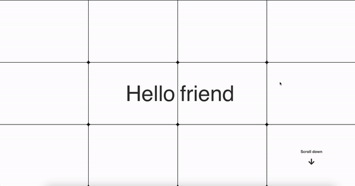

# ffcoders-page

A simple and beautiful page to capture new ideas and members.

## Description

This project is a single-page application built with React. It features a welcoming animation and a form to capture ideas from visitors. The page is designed to be visually appealing and interactive.

## Dependencies

The main dependencies used in this project are:

- React: A JavaScript library for building user interfaces.
- SCSS: A CSS preprocessor that adds power and elegance to the basic language.
- react-icons: A library for including popular icons in your React projects.

## Features

- **Welcome Animation**: The home page includes a flipping animation that is triggered after a certain number of scrolls.
- **Idea Form**: A form to capture ideas from visitors, including email validation and a thank you message after submission.

## Usage

To run this project locally, follow these steps:

1. Clone the repository: https://github.com/ffcoders/ffcoders-page.git
2. Install the dependencies in your side, run: npm install
3. Start the development server, run: npm start
   